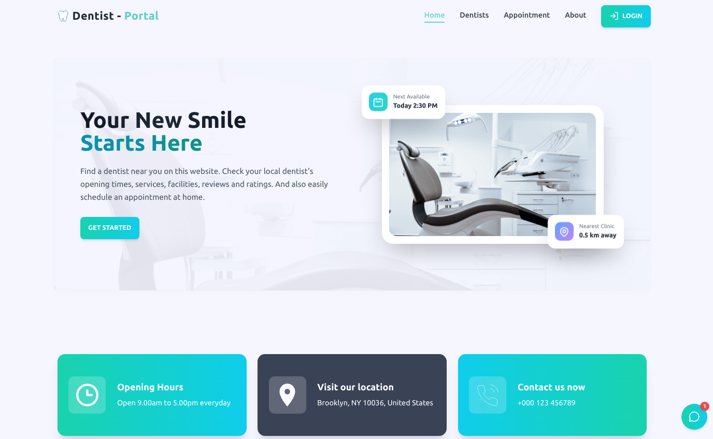

# 🦷 Dental Portal

<div align="start">
  
  
  [](https://dentists-portal-kappa.vercel.app/)
  [](https://github.com/Electra51/Dentists-portal)
  
  **A complete role-based dental appointment & prescription management system with separate dashboards for Patients, Dentists, and Admin.**
  
  [Live Demo](https://dentists-portal-kappa.vercel.app/) · [Report Bug](https://github.com/Electra51/Dentists-portal/issues) · [Request Feature](https://github.com/Electra51/Dentists-portal/issues)

</div>

---

## Preview

<div align="start">
  
</div>

---

## Features

### Public Pages
- Landing/Home Page
- Dentist List Page
- Appointment Info Page
- About Page
- Login & Signup

### Patient Features
- Login/Signup & profile completion
- Book appointment with verified dentists
- View appointment status (Pending/Confirmed/Completed/Archived)
- View & download prescriptions
- View next visit date
- Submit reviews (only after taking treatment)
- Patient Dashboard with:
   - Appointments
   - Prescriptions

### Dentist Features
- Signup & complete profile
- Request verification from Admin
- Set weekly schedule
- Manage appointments (view/accept/reject)
- Write & print digital prescriptions
- Add medicines, dosage, instructions
- Add next-visit date
- Mark payment as received
- View patient list
- View system-approved reviews
- Dentist Dashboard with:
- Appointments
   - Schedule
   - Prescriptions
   - Patients
   - Reviews 

### Admin Features
- Login (no registration required)
- Verify/Reject dentist requests
- View all dentists, patients and all appointments.
- Delete archived appointments permanently
- Approve/Reject patient reviews
- View revenue/payment overview
- Admin Dashboard
   - Dentists
   - Patients
   - Appointments
   - Reviews and Revenue

### Appointment Life-Cycle
- Patient books appointment
- Dentist receives appointment request
- Dentist approves/rejects
- Patient visits clinic physically
- Dentist writes prescription
- Dentist marks payment as received
- Appointment becomes completed
- If patient doesn’t visit or dentist doesn’t approve → archived
- Admin can delete archived appointments permanently


### Technology Stack


### Google Lighthouse Score

```
Performance:     95/100
Accessibility:   92/100
Best Practices:  96/100
SEO:             94/100
```

### Installation

1. **Clone the repository**

   ```bash
   git clone https://github.com/electra51/Dentists-portal.git
   ```

2. **Navigate to the project directory**

   ```bash
   cd Dentists-portal
   ```
3. **Run project**
 
   ```bash
   npm install
   ```
    ```bash
   npm start
   ```

---

## Contributing

Contributions are always welcome! Here's how you can help:

1. Fork the project
2. Create your feature branch (`git checkout -b feature/AmazingFeature`)
3. Commit your changes (`git commit -m 'Add some AmazingFeature'`)
4. Push to the branch (`git push origin feature/AmazingFeature`)
5. Open a Pull Request

---


## Author

**Electra51**

- Portfolio: https://nextjs-my-portfolio-electra51.vercel.app/
- GitHub: [@electra51](https://github.com/electra51)
- LinkedIn: https://www.linkedin.com/in/safayet-nur/

---


---

<div align="start">

### Star this repository if you found it helpful!

Made with ❤️ by Electra51

**Happy Coding!** 🚀

</div>
